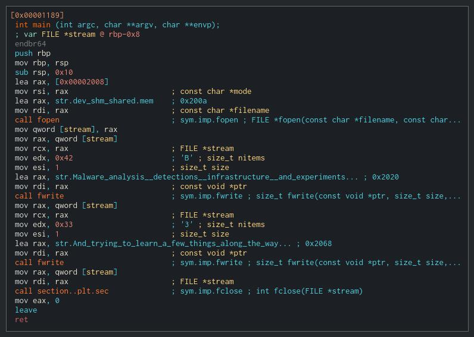

# What is this? 

/dev/shm is just a collection, a learning resource for myself, and a way to share knowledge
gained with others. 

```c
#include <stdio.h>
#include <stdlib.h>

int main(void)
{
   FILE *fp;

   fp = fopen("/dev/shm/shared.mem", "w");

   fputs("Malware analysis, detections, infrastructure, and experiments...\n\n", fp);
   fputs("\tAnd trying to learn a few things along the way...\n", fp);

   fclose(fp);

   return 0;
}
```

## Learning by failing forward

Mostly, these are personal notes collected as I continue to learn about reverse engineering, malware analysis,
and how actual adversaries (and red teams) operate. In that pursuit, I want to understand how adversaries communicate,
the protocols used, and how they are able to evade or defeat protections and detections defenders have in place.

This process of experiential and experimental learning is best suited for me, in this type of environment.
If I can do it, or implement it, then I probably understand it!

!!! Warning
    
    These are my experiments, and failures, in the pursuit of learning. I take no credit for any original research
    here. I stand on the shoulders of other researchers who have developed and employed these techniques to (hopefully!)
    improve security.

    Follow me at your own risk - to time and frustration.

<figure markdown>
  { width="700" }
  <figcaption> Main Function</figcaption>
</figure>

## Contact Me

You can find me in many of the usual social media locations, but primarily:

- :fontawesome-brands-twitter: - [@linkavych](https://twitter.com/linkavych)
- :fontawesome-brands-discord: - [@linkavych](https://discordapp.com/users/linkavych#8928)
- :fontawesome-brands-linkedin: - [Linkedin](https://www.linkedin.com/in/adamvlink)
