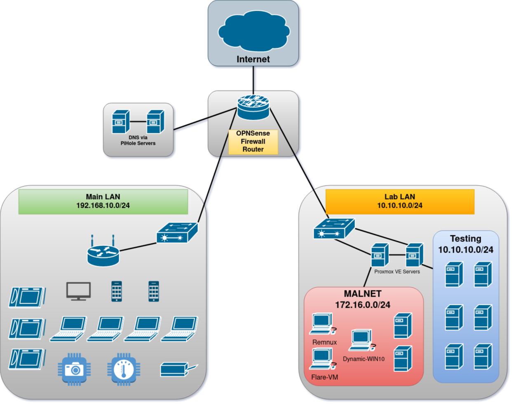

# Lab Infrastructure

Building a home lab is valuable for a number of reasons: understand networking, test an exploit, or
see how malware functions in a controlled environment. So, build one - for whatever purpose - and
then test things out to see how they work. Never configured a firewall before? Sping up an [OpenBSD](https://www.openbsd.org/)
VM and experiment with [PF](https://www.openbsd.org/faq/pf/). Or create an entire Active Directory
environment for testing modern exploitation in a Windows environment - not to mention the challenge
or learning to build and configure that environment. For whatever reason, build a lab - you'll learn soemthing.

## The Design

Overall, the design of my lab environment is a byproduct of my broader home network. There are two main subnets
running on my home network (for now):

1. 192.168.10.0/24 - Main LAN
2. 10.10.10.0/24 - Lab LAN

Both of these networks connect to my edge router and firewall: [OPNSense](https://opnsense.org/).
For routing, nothing from the `Lab LAN` can call call out to the `Main LAN` directly. However, a pair of machines
in my `Main LAN` are allowed to communicate into the `Lab LAN` to interact with the various machines.

Internal to the lab network is another subnet: the MALNET, at 172.16.0.0/24, which is where I have built
my malware analysis environments.

<figure markdown>
  
  <figcaption>Network Diagram</figcaption>
</figure>

## The MALNET

To interact with machines on the `MALNET` I have built an [Apache](https://www.apache.org/) [Guacamole](https://guacamole.apache.org/) server as a frontend. 
It has two (virtual) interfaces, one on the 10.10.10.0/24 and one on the 172.16.0.0/24 subnets. In this way, I'm limiting the contact the
malware environment can have with the dirty internet, but it's not airtight - nor do I need it to be. In fact, at some point
I'll probably change things up to allow the malware machines to reach otu to the public internet
via VPN in order to tap into more active malware campaigns. This works for now, however.

Internal to the MALNET I have a minimum of three machines at a given time:

- [REMNUX](https://remnux.org/) - Acts as a gateway for the other devices (Windows and *Nix), static analysis platform, and general base of operations.
- [Dynamic-WIN10](https://github.com/mentebinaria/retoolkit) - A Windows 10 VM configured to serve as a dynamic analysis platform for Windows malware. Not FLARE-VM, but close enough.
- [FLARE-VM](https://github.com/mandiant/flare-vm) - Another Windows 10 VM setup with the full FLARE VM environment, which is quite heavy, but I like to have it available.
- Various linux or BSD distributions as required for other malware testing.

## The Build

I will use this section to document the build-out of this lab environment, on a [PROXMOX VE](https://www.proxmox.com/en/proxmox-ve) backbone,
in order to share another method of creating a lab environment. Mine is more complex than some, and certainly
less than many others, but I built it to keep learning.
